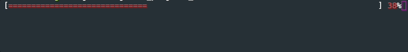
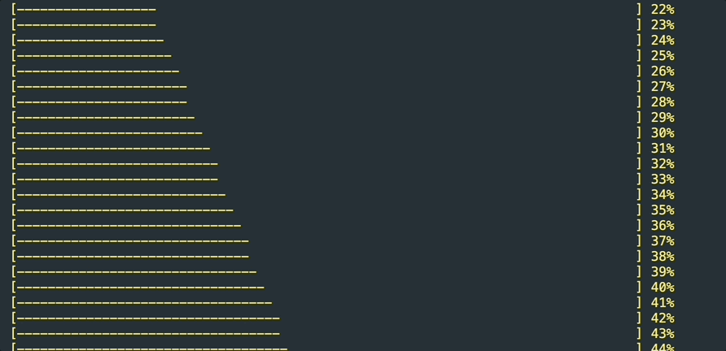

# RichProgressBar

RichProgressBar is a Rust crate that provides a customizable progress bar for console applications.

## Features

- Set the color of the progress bar.
- Set the total value of the progress bar.
- Set the progress character.
- Set the display mode of the progress bar (inline or new line).
- Set the length of the progress bar.
- Increment the current value of the progress bar

## Usage

Add this to your `Cargo.toml`:

```
[dependencies]
rich_progress_bar = "1.0.0"
```

And this to your crate root:

```rust
extern crate rich_progress_bar;
```

Here's a simple example of how to use ProgressBar:

```rust
use rich_progress_bar::RichProgressBar;
use rich_progress_bar::Colors;
use rich_progress_bar::DisplayMode;

let mut progress = RichProgressBar::new();
progress
  .set_color(Colors::Black)
  .set_bar_length(80)
  .set_display_mode(DisplayMode::Inline)
  .set_total(100);

for _ in 0..100 {
  progress.inc();
  std::thread::sleep(std::time::Duration::from_millis(150));
}
```




Example with `NewLine` display mode

```rust
fn main(){
  let mut progress = RichProgressBar::new();
  progress
    .set_color(Colors::Yellow)
    .set_bar_length(80)
    .set_display_mode(DisplayMode::NewLine)
    .set_progress_character('-')
    .set_total(100);
  
  for _ in 0..100 {
    progress.inc();
    std::thread::sleep(std::time::Duration::from_millis(150));
  }
}
```


